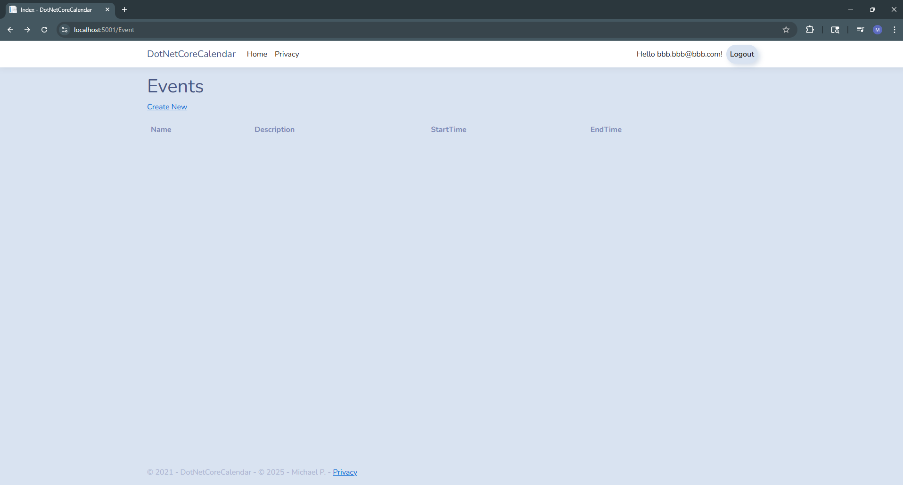

# TimeGrid — Your Personal Calendar App (ASP.NET Core + EF Core):

# Overview:

TimeGrid is a full-stack, C# .NET web application that enables authenticated users to manage their personal calendars with events, adding descriptions, times, dates, and locations to these events. It utilizes ASP.NET Core MVC (net9.0), Entity Framework Core 9 (SQL Server), ASP.NET Core Identity for auth, and FullCalendar for a smooth UI with month/week/list views. You can add, edit, and delete events, assign and create locations for the events (e.g., “Office”), and view your schedule on an interactive calendar.

While developing this program, I designed it to showcase my skills and knowledge by incorporating the following different concepts. I built this project to showcase my skills in full-stack web development, utilizing C#, SQL, EF Core, Identity, and clean architecture with dependency injection.

# Features:

- **Interactive calendar UI:** This calendar application is powered by FullCalendar (https://fullcalendar.io/) to provide an interactive and aesthetically pleasing user interface (month, week, and list views).
- **Event management (CRUD):** The application practices CRUD to allow the user the ability to create, update, delete, and save different calendar events, with names, optional descriptions, optional locations, and optional start/end times.
- **Durable Data Persistence:** Events and locations are stored in SQL Server via EF Core; the schema is versioned with migrations, so data survives app restarts and upgrades.
- **Authentication & Authorization:** ASP.NET Core Identity; allows users to log in and log out of an account they register with the calendar application. This allows the calendar application to hold onto and remember/load the current logged in owners calendar, which allows the user to view/manage their own events.
- **Bootstrap 4 UI:** The Bootstrap UI allows the user to add events directly from the calendar via the modal form.
- **Lazy loading:** This allows the users to navigate calendar properties via EF Core proxies.
- **Clean separation:** Controllers, view models, data access layer (IDAL), and the rest of the project are all cleanly separated from one another to allow for seamless future improvements and upcoming features to be added and developed easily.

# Current Finished Product Images:

### Main Menu:

### Privacy Policy Page:

### Register Account Page:

### Register Account Confirmation:

### Log In Page:

### Main Menu (Logged In):

### Locations Page:

### Create Location Page:

### Location Creation Success:

### Events Page:

### Create Event Page:

### Event Creation Success:

### Main Menu (Logged In + Added Event):

### Events Overview Interface:

## Technologies Used:
- .NET 9 (ASP.NET Core MVC) — TargetFramework: net9.0
- Entity Framework Core 9 — SQL Server provider + LazyLoading proxies
- ASP.NET Core Identity — authentication & user management
- FullCalendar 5.x (bundled under wwwroot/js/main.js)
- Bootstrap 4.3 (bundled locally under wwwroot/lib/bootstrap) + Font Awesome icons

# Usage Instructions:

# File Pathway Tree/ File Directory:
Please check the File Pathway Tree Document File found in this project's repository.

# Installation & Setup:
### **1) Prerequisites:**
- 1.1.1) .NET SDK 9.0
- 1.2.1) SQL Server Express LocalDB (Windows) or access to a SQL Server instance
- 1.2.2) Default dev connection uses LocalDB, configured in appsettings.json
- 1.3.1) Make sure an IDE is installed; for this tutorial, Visual Studio 2022 Community Edition will be the one utilized. 
### **2) Clone And Restore:**
- 2.1.1) Download or clone this repository to your local machine.
- 2.2.1) After, open the project folder and open the Developer Command Prompt in the IDE via the Tools drop-down menu.
- 2.3.1) In the Developer Command Prompt Menu, to restore the packages for the program, type in the following prompt.
- 2.3.2) *dotnet restore* (Type this into the terminal)
### **3) Configure The Connection String:**
- 3.1.1) By default, the app reads ConnectionStrings:DefaultConnection from the configuration.
- 3.2.1) You can either keep LocalDB (Windows) as it currently is in appsettings.json, to have it connect to a local database. OR you can do the following in 3.3.1.
- 3.3.1) Set a secure connection string via the User Secrets from within development:
- 3.3.2) Once in the IDE and while still being inside the project folder, type in the following. 
- 3.3.3) *dotnet user-secrets init* (Type this into the terminal)
- 3.3.4) In 3.3.5 below, there is an example of what the next Developer Command Prompt Menu would be to get the application to connect to your server/DB (edit the connection address to be your server/DB).
- 3.3.5) dotnet user-secrets set "ConnectionStrings:DefaultConnection" "Server=(localdb)\\mssqllocaldb;Database=TimeGrid;Trusted_Connection=True;MultipleActiveResultSets=true;TrustServerCertificate=True" (Type this into the terminal)
### **4) Apply EF Core Migrations:**
- 4.1.1) If it has not been installed previously, or if you need the EF CLI package installed, use the following Developer Command Prompt Menu command.
- 4.1.2) dotnet tool install --global dotnet-ef (If not already installed | Type this into the terminal)
- 4.2.1) Then use the next Developer Command Prompt Menu command to update the database.
- 4.2.2) dotnet ef database update (Type this into the terminal)
- 4.3.1) These commands will create the identity tables and app tables (Events & Locations) in the configured database.
### **5) Run the app:**
- 5.1.1) To run the calendar application, after unzipping the file into your hard drive/cloning the project, type the following command into the Command Prompt Menu (Package Manager Console if you're using Visual Studio Code Community 2022).
- 5.1.2) Update-Database (Type this into the terminal). This creates the required database/tables in SQL Server LocalDB.
- 5.1.3) dotnet run (Type this into the terminal) - (OR click the green run arrow button on the IDE after opening and being in the DotNetCoreCalendar.sln file 
- 5.1.4) This should then open a new tab on your device's preferred web surfing application (Chrome, Firefox, Edge, etc.) with the calendar application up, running, and ready to go. 
- 5.1.5) If it did not open automatically, open a new tab in your preferred web surfing application and open the URL being shown in the console. (Currently: https://localhost:5001).

## Troubleshooting:
If any of the following issues occur, please try the following troubleshooting solutions.
- **1) dotnet ef not found:**
- 1.1.1) Reinstall or install the following tool via the Developer Command Prompt Menu.
- 1.1.2) dotnet tool install --global dotnet-ef (Type this into the terminal).
- 1.2.1) Afterwards, run the following prompt into the Developer Command Prompt Menu.
- 1.2.2) dotnet ef database update (Type this into the terminal).

- **2) Build failed while running migrations:**
- Each of the following prompts should be entered into the Developer Command Prompt Menu to attempt the solution.

- *2.1) Quick Fix:*
- 2.1.1) Clean and rebuild the project, once in your project folder with .csproj.
- 2.1.2) dotnet clean (Type this into the terminal) then | dotnet restore (Type this into the terminal) then | dotnet build (Type this into the terminal) then | dotnet ef database update (Type this into the terminal).

- *2.2) Dotnet ef Is Missing:*
- 2.2.1) dotnet tool install --global dotnet-ef (Type this into the terminal).

- *2.3) If You Have Multiple Projects That Are Getting In The Way (Set Project & Startup):*
- 2.3.1 dotnet ef database update -p DotNetCoreCalendar.csproj -s DotNetCoreCalendar.csproj (Type this into the terminal).

- 2.4) If The Last Migration Is Broken & Not Applied:

- 2.4.1) dotnet ef migrations remove (Type this into the terminal) then | dotnet ef migrations add FixBuild (Type this into the terminal) then | dotnet ef database update (Type this into the terminal).

- **3) Connection issues:**
- 3.1.1) If you run into database connection issues, verify your connection string is correct. This will be either via *User Secrets* if you’re connecting to your personal database or via *appsettings.json* if you’re connecting to a local database.
- 3.2.1) If you are not using a Windows operating system computer, it is highly suggested to switch to a SQL Server instance/container or update EF to use SQLite. 
- 3.2.2) If you do step 3.2.1, you will also need to change the provider in the following files: Program.cs and ApplicationDbContext.cs.

## How It Works:
- 1.1) The “Your Personal Calendar” application/webpage requires you to register and/or sign in to the application before you are able to use the calendar application. First, a user must create an account and log in to enjoy their personalized calendar experience.
- 2.1) "My Calendar" is the landing page for the "Your Personal Calendar” application/webpage. In the My Calendar view, once logged in (or registered), you will be able to view your personal schedule in a list, week, or monthly format and see upcoming events that have been entered. The "How To Use" yellow banner also provides a brief set of user instructions and can be hidden via the x button at any time.
- 3.1) To register an account, click the Register button in the top right, then fill out and enter a fake email and password for the account. It will then prompt you to click a button that auto-authenticates the account, simulating a real authentication setup for the website.
   - 3.2) The site also provides documentation on how to set up third-party authentication and an email sender for authentication. However, since this is for demonstration purposes only, I purposely omitted those for data privacy and safety reasons.
- 4.1) After your account has been registered, log in by clicking the login button and entering your login details you just entered for the Register button. If you want to use this application as a persistent calendar, be sure to save your login credentials. Data is saved across sessions and can be loaded repeatedly via the calendar application and the local database.
- 5.1) Next, click the Locations button to create/edit/delete location records. When initially creating or editing an event, you can assign a location to the event on the calendar. However, the location must first be added in the Locations tab.
   - 5.2) Locations are required to be entered and selected for each event.
- 6.1) Using the Events tab, you can enter calendar event entries into the application. In this tab, you can enter an event name, description, start and end dates and times, along with a selected location from the locations drop-down menu created in step 5.1.
- 7.1) The privacy page is utilized to share a fake/demonstration version of a website's privacy or terms and conditions page. Listing numerous data privacy and other terms and conditions for the application/site that are all fake and non-enforceable.
- 8.1) Ownership of created calendar events is enforced through the custom UserAccessOnly filter; this ensures that only the event owner can access/modify their own calendar items that they created.

## How It Works (Architecture Version):
- **ASP.NET Core MVC with minimal hosting (Program.cs):** wires up DI, EF Core, Identity, Razor Pages, and MVC routes. 
- **EF Core 9 + SQL Server:** ApplicationDbContext manages Events and Locations plus Identity tables; lazy loading proxies are enabled as well. 
- **Data Access Layer:** IDAL interface and DAL implementation wrap allow for common queries and persistence logic. 
- **View Models:** The EventViewModel supplies event data and location dropdowns for the project forms. 
- **User-Interface:** Layout.cshtml loads Bootstrap; Home/MyCalendar.cshtml initializes FullCalendar and posts form data to EventController.Create. 

# Contributing To the Codebase:

Contributions are welcome! Please fork this repository, and create a feature branch: git checkout -b feature/your-idea . Then add your changes, fixes, or new features to the project under this branch, and then commit the changes with a clear description. Afterwards, open a Pull Request describing the changes and fixes, along with the rationale behind them.

# Acknowledgments:

- FullCalendar for the robust calendar UI 
- Bootstrap for the responsive styling 
- ASP.NET Core Identity for authentication scaffolding 
